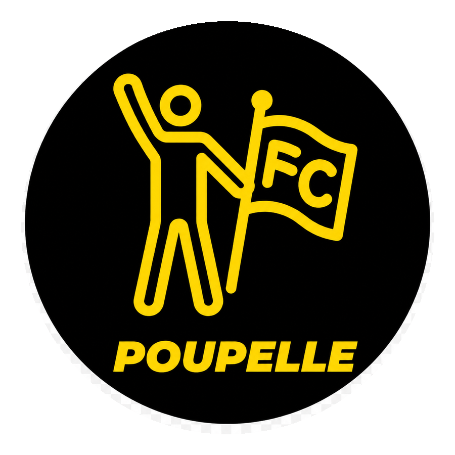

# FC POUPELLE 公式HP 取扱説明書

FC POUPELLEの公式ホームページです。GitHub Pagesで公開する静的HTML/CSSサイトとして運用します。

このREADMEは、初見者・納品先・将来の自分が、最低限の更新作業を迷わず再開できるようにするための取扱説明書です。

## 運用の基本方針

- GitHub Web画面での手動アップロードは使わない
- GitHub DesktopでCloneしたローカルフォルダを本番作業場所にする
- CodexはClone済みフォルダ内のファイル確認・編集・報告だけを担当する
- Git操作はユーザーがGitHub Desktopで行う
- 本番HTMLは `index.html` のみ
- GitHub Pagesで公開される入口は `index.html`
- `fc-poupelle_HPsite.html` は旧版・重複ファイルのため、今後は使用しない
- 本番ロゴは `assets/logo.png` に統一する

## 本番作業フォルダ

今後の作業対象は必ず以下のClone済みフォルダです。

```text
C:\Users\tsocc\Local\WebSite_HP_FC POUPELLE\Github\fc-poupelle-site
```

このフォルダは、GitHubリポジトリ `Takumi2513/fc-poupelle-site` をGitHub DesktopでCloneした本番作業フォルダです。

## このサイトの目的

- FC POUPELLEの活動内容を伝える
- 次回イベントや参加導線を案内する
- Instagramへ誘導する
- LINE公式アカウントから参加申込・問い合わせにつなげる
- 支払い方法やFAQを確認できるようにする

## 全体導線

### HP

GitHub Pagesで公開される公式HPです。入口ファイルは `index.html` です。

### Instagram

活動写真、開催風景、最新のお知らせを発信する場所です。

```text
https://www.instagram.com/fc_poupelle?igsh=ZDA5YXZqcW1yeWly
```

### LINE公式

参加申込・問い合わせの主な導線です。

```text
https://lin.ee/Spplu6g
```

### リッチメニュー

LINE公式アカウントのリッチメニューから、HP内の各セクションへ直接移動する可能性があります。
そのため、以下のセクションIDは原則変更しないでください。

```text
#about
#event
#payment
#profile
#instagram
#contact
```

## 本番ファイル構成

今後の本番運用では、以下の構成を基本にします。

```text
fc-poupelle-site/
├─ index.html
├─ style.css
├─ README.md
├─ CHANGELOG.md
└─ assets/
   └─ logo.png
```

現在は整理前のファイルとして `fc-poupelle_HPsite.html` や未使用画像が残っている場合があります。今後は `index.html` を唯一の本番HTMLとして扱います。

## 各ファイルの役割

### `index.html`

本番HTMLです。GitHub Pagesで公開される入口ファイルです。
ページ本文、リンク、イベント情報、セクション構成を編集する場合はこのファイルを更新します。

### `style.css`

サイト全体の見た目を管理するCSSです。
色、余白、カードデザイン、スマホ表示、ロゴ表示などを編集する場合はこのファイルを更新します。

### `assets/logo.png`

本番ロゴ画像です。HP内のロゴ表示はこの画像に統一します。

### `README.md`

この取扱説明書です。運用ルールや更新手順を残します。

### `CHANGELOG.md`

変更履歴です。いつ、何を変えたかを短く記録します。

### `fc-poupelle_HPsite.html`

旧版・重複ファイルです。今後は使用しません。
削除する場合は、外部リンクやLINEリッチメニューから直接参照されていないことを確認してから行ってください。

## ユーザーがやること

Git操作や公開判断はユーザーが行います。

1. GitHub Desktopを開く
2. 作業前に `Fetch origin` を押す
3. `Pull origin` が出た場合は実行し、ローカルをGitHub最新版にする
4. Codexに作業依頼する
5. ローカルで `index.html` を表示確認する
6. GitHub Desktopで変更ファイルを確認する
7. Commit messageを書く
8. `Commit to main` を押す
9. `Push origin` を押す
10. GitHub Pagesで公開URLを確認する
11. 必要に応じて `?v=数字` でキャッシュ回避確認する
12. LINE公式・Instagram・リッチメニューのリンク設定を確認する
13. 最終的な文言・デザイン・導線を判断する

## Codexがやること

Codexはファイルの確認・編集・報告を担当します。

- Clone済みフォルダ内のファイルを読む
- README.mdを確認する
- CHANGELOG.mdを確認する
- `index.html` を本番HTMLとして編集する
- `style.css` を編集する
- `assets/` 内の画像参照状況を確認する
- 必要に応じてREADME.mdを更新する
- 必要に応じてCHANGELOG.mdを更新する
- `section id` を維持する
- 黒×くすみゴールドのデザイン方針を維持する
- スマホ表示を考慮して修正する
- 作業後に変更ファイルと確認ポイントを報告する

## Codexがやらないこと

Codexは以下を実行しません。

- `git fetch`
- `git pull`
- `git commit`
- `git push`
- `git merge`
- `git rebase`
- `git reset`
- `git clean`
- GitHub Web画面での手動アップロード
- GitHub Pages設定変更
- LINE公式アカウント側の設定変更
- Instagram側の設定変更
- リッチメニュー本体の設定変更
- 最終的な事業判断・デザイン判断

## GitHub Desktopでの更新フロー

作業フローは以下に統一します。

```text
GitHub上の最新版を確認
↓
Clone済みフォルダをCodexで編集
↓
ローカルで確認
↓
GitHub Desktopで変更確認
↓
Commit to main
↓
Push origin
↓
GitHub Pagesで公開確認
```

## Clone / Commit / Push の意味

### Clone

GitHub上のリポジトリを、自分のPCにコピーすることです。
今後はCloneしたフォルダを本番作業場所にします。

### Commit

変更内容をひとまとまりの履歴として保存することです。
例: `docs: update README workflow`

### Push

Commitした変更をGitHubへ送ることです。
Push後、GitHub Pagesに反映されます。

## `assets/` の運用ルール

- 実際にHPで使う画像だけを入れる
- 使っていない画像や作業途中の素材は原則入れない
- 画像名はなるべく小文字英数字にする
- ロゴは `assets/logo.png` に統一する
- 画像を差し替えたら、GitHub Pages上で反映されるまで少し待つ

## ロゴ画像の扱い

本番ロゴは以下です。

```text
assets/logo.png
```

HTML内では以下のように参照します。

```html

```

ロゴを差し替える場合は、ファイル名を変えずに `assets/logo.png` を上書きすると、HTMLを変更せずに済みます。

## イベント情報の更新方法

イベント情報は `index.html` の `id="event"` セクション内にあります。

主に更新する項目:

- イベント名
- 日時
- 場所
- 参加費または料金
- 対象
- ステータスや補足文
- LINE申込ボタンの表示文

申込人数や残り枠を表示する場合は、運用負荷が上がるため事前に方針を決めてから追加してください。

## LINEリンク・Instagramリンクの変更方法

### LINE公式リンク

現在のLINE公式リンク:

```text
https://lin.ee/Spplu6g
```

`index.html` 内で `lin.ee` を検索し、必要な箇所を新しいURLに置き換えます。

### Instagramリンク

現在のInstagramリンク:

```text
https://www.instagram.com/fc_poupelle?igsh=ZDA5YXZqcW1yeWly
```

`index.html` 内で `instagram.com` を検索し、必要な箇所を新しいURLに置き換えます。

## GitHub Pages反映時の注意点

- Pushしてから公開ページに反映されるまで、少し時間がかかることがあります
- 数十秒から数分待ってから確認してください
- すぐに変わらない場合でも、まずは焦らず時間を置いてください
- GitHub Pagesの設定で公開ブランチと公開フォルダが正しいか確認してください

## CSSや画像が反映されない時のキャッシュ対策

ブラウザやGitHub Pagesが古いCSS・画像を表示することがあります。これをキャッシュと呼びます。

確認方法:

1. ブラウザで強制更新する
   - Windows: `Ctrl + F5`
2. 直接CSSを開く

```text
https://公開URL/style.css?v=0.6.7
```

3. 直接ロゴ画像を開く

```text
https://公開URL/assets/logo.png
```

CSSを更新した場合は、`index.html` 内の読み込みバージョンを上げると反映されやすくなります。

```html
<link rel="stylesheet" href="style.css?v=0.6.8" />
```

## よくあるトラブルと確認ポイント

### 公開ページが更新されない

- GitHub DesktopでPushできているか確認する
- GitHub Pagesの反映を数分待つ
- ブラウザで `Ctrl + F5` を押す
- `style.css?v=...` の番号が上がっているか確認する

### ロゴが古い・白い縁が見える

- `assets/logo.png` が最新版か確認する
- GitHub上の `assets/logo.png` を直接開く
- ブラウザのキャッシュを強制更新する

### レイアウトが崩れる

- `style.css` が読み込まれているか確認する
- `index.html` のCSS読み込みパスが `style.css?v=...` になっているか確認する
- スマホ幅でも確認する

### LINEやInstagramに飛ばない

- `index.html` 内のURLが正しいか確認する
- `target="_blank"` と `rel="noopener noreferrer"` が付いているか確認する

### リッチメニューから目的の場所へ飛ばない

- `#about`, `#event`, `#payment`, `#profile`, `#instagram`, `#contact` が残っているか確認する
- セクションIDのスペルを変えていないか確認する

## 更新前チェックリスト

- [ ] GitHub Desktopで `Fetch origin` 済み
- [ ] 必要な場合は `Pull origin` 済み
- [ ] 作業フォルダがClone済み本番フォルダである
- [ ] 編集対象が `index.html` である
- [ ] `fc-poupelle_HPsite.html` を編集していない
- [ ] セクションIDを変更していない
- [ ] LINEリンクが正しい
- [ ] Instagramリンクが正しい
- [ ] ロゴ画像が `assets/logo.png` のまま
- [ ] `style.css` の変更が必要な場合、CSSバージョンを上げた
- [ ] PC表示を確認した
- [ ] スマホ幅の表示を確認した
- [ ] READMEやCHANGELOGが必要に応じて更新されている
- [ ] GitHub Desktopで変更ファイルを確認した
- [ ] Push後、GitHub PagesのURLで確認した
